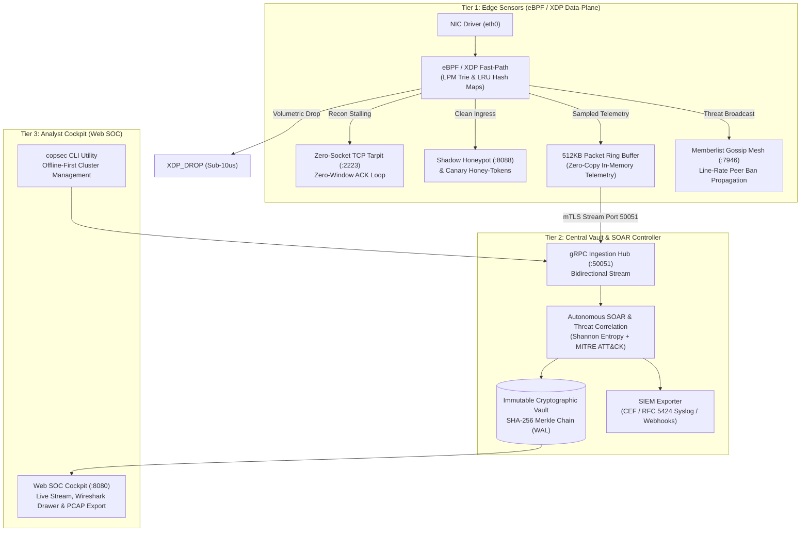

<p align="center">
  <a href="https://github.com/CoPdasten/copsec">
    
  </a>
</p>

# CoPSeC — High-Performance Open-Source eBPF/XDP Active Defense Engine

> High-performance, kernel-native intrusion detection, zero-socket TCP tarpits, deception honey-tokens, pre-attack PCAP forensics, cryptographic audit chaining, and real-time multi-node SOC triage built with Go, eBPF/XDP, C++, and SQLite.
> 
> **Geliştirici / Developer:** **Eyyüp Efe Adıgüzel** ([eyupadiguzel20@gmail.com](mailto:eyupadiguzel20@gmail.com))

<p align="center">
  
  
  
  
  
  
  
  
  
</p>

---

## Architecture Overview

CoPSeC partitions responsibilities between high-speed kernel edge sensors (**Collectors**) and a centralized intelligence & policy orchestrator (**Controller**), interconnected over secure bidirectional gRPC/mTLS channels and visualized via a high-contrast zero-latency analyst cockpit.



---

## Core Capabilities Matrix

| Architectural Pillar | Operational Domain | Key Technical Mechanisms & Guarantees | SLA / Benchmark |
| :--- | :--- | :--- | :--- |
| **Kernel & L4 Fast-Path** | Edge DMZ Sensor | eBPF/XDP driver-level hook, `XDP_DROP`, LPM Trie blocklist, Zero-Window TCP Tarpit (`:2223`) | Sub-10 µs Drop Latency |
| **Algorithmic Detection & Deception** | Edge & Central Core | Shannon Entropy math ($\mathcal{H} \ge 3.8$), Shadow Honeypots (`:8088`), Canary Honey-Tokens, MITRE TTP mapping | 0% False Positives on Canaries |
| **Forensic Memory Management** | Volatile RAM Edge | 30s in-memory circular ring buffer, atomic snapshot clone, async Libpcap 2.4 serializer (`0xa1b2c3d4`) | Zero Disk Wear during Ingress |
| **Peer-to-Peer Threat Mesh** | Distributed Fleet | HashiCorp Memberlist Gossip (`:7946`), sub-second ban replication across edge nodes | Sub-Second Mesh Sync |
| **Zero-Trust & Cryptographic State** | Central Vault Hub | 100% prepared SQL (`?`), append-only audit trail, trigger-enforced `UPDATE`/`DELETE` abort, SHA-256 hash chaining | Non-Repudiable Audit Ledger |
| **Upstream DDoS Mitigation** | Upstream Transit / ISP | Autonomous BGP-4 speaker (RFC 4271), RFC 7999 RTBH Blackhole (`65535:666`) trigger (>200k PPS) | Autonomous Null0 Discard |

---

## Key Subsystems & Features

### 1. Dual-Stack IPv4/IPv6 Kernel Fast-Path & NDP Safety
* In-kernel XDP filter simultaneously inspects IPv4 (`ETH_P_IP`) and IPv6 (`ETH_P_IPV6`) at driver line rate before socket allocation (`sk_buff`).
* **NDP Safeguard:** ICMPv6 types 133–136 (Router/Neighbor Solicitation & Advertisement) are unconditionally passed (`XDP_PASS`), preventing gateway isolation during floods.
* **Longest Prefix Match (LPM) Trie:** In-kernel `BPF_MAP_TYPE_LPM_TRIE` (`block_lpm_map`) provides $O(1)$ subnet and CIDR prefix blocking.

### 2. Zero-Socket Asymmetric TCP Tarpit (`:2223`)
* Completes the 3-way handshake and immediately advertises a TCP Window size of `0`.
* Traps port scanners and vulnerability bots in perpetual wait states, exhausting adversary connection pools while consuming zero Linux host sockets.

### 3. Distributed Threat Synchronization (Gossip Mesh `:7946`)
* Decentralized peer-to-peer threat propagation utilizing HashiCorp `memberlist`.
* When any edge sensor quarantines an attacker, adjacent sensors immediately inject the IP into their local eBPF map without waiting for central controller polling.

### 4. Algorithmic Threat Detection & Deception
* **Shannon Entropy Analysis:** Computes mathematical entropy $\mathcal{H}(X) = -\sum P(x_i) \log_2 P(x_i)$ over HTTP headers, raw payloads, and DNS queries to detect encrypted stagers and obfuscated shellcode ($\mathcal{H} \ge 3.8$).
* **Shadow Honeypots (`:8088`):** Decoy HTTP services, admin login interfaces, and vulnerable endpoints.
* **Canary Honey-Tokens:** Dynamically planted AWS keys (`AKIA...`), DB connection strings, and bearer tokens providing 100% high-confidence alerts with zero false positives.
* **MITRE ATT&CK Mapping:** Automatic correlation to tactics and techniques (e.g. `T1498.001`, `T1027`, `T1046`, `T1190`, `T1071.004`).

### 5. In-Memory 30s Forensic Ring Buffer & Wireshark Cockpit
* **Zero Disk Wear:** Raw ingress frames are kept in volatile RAM using a circular 30-second sliding window.
* **Incident-Triggered Snapshot:** On critical trips (canary touched, volumetric flood, RCE), the buffer is atomically copied (sub-10 µs) and serialized to standard Libpcap 2.4 (`.pcap`) asynchronously.
* **Web SOC Wireshark Drawer:** Browser-based split-pane packet viewer with layer color-coding (L2/L3/L4/L7), synchronized Hex/ASCII inspection, Wireshark filter syntax, and 1-click `.pcap` downloads.

### 6. Cryptographic Vault & Non-Repudiable Audit Chaining
* Local SQLite storage configured in WAL mode, strictly isolated with parameterized queries (`?`).
* Database triggers (`prevent_audit_update`, `prevent_audit_delete`) abort any tampering with `CRYPTOGRAPHIC_VIOLATION`.
* Every entry is sequentially linked via SHA-256 hash chaining:
  $$\text{Hash}_k = \text{SHA256}(\text{Hash}_{k-1} \,\|\, \text{Actor} \,\|\, \text{IP} \,\|\, \text{Action} \,\|\, \text{Target} \,\|\, \text{Justification})$$

### 7. Upstream BGP-4 Anycast & RFC 7999 RTBH Signaling
* In-tree BGP-4 speaker establishing peering sessions with upstream routers (BIRD, FRR, Cisco, Juniper).
* Triggers RFC 7999 Well-Known Blackhole Community `65535:666` (`0xFFFF029A`) when floods exceed 200,000 PPS. Automatically withdraws the route once traffic normalizes.

### 8. Enterprise SIEM Streaming & Operational Break-Glass
* Streams standardized ArcSight Common Event Format (CEF) and RFC 5424 Syslog over TCP/TLS with mTLS to Wazuh, Splunk, or Elastic.
* Asynchronous webhook dispatcher for Slack, Discord, and SOAR HTTP webhooks.
* **Break-Glass Emergency Flush:** CLI (`copsec emergency-flush`), REST API (`POST /api/quarantine/emergency-flush`), and Web SOC modal instantly unban all kernel maps across the fleet in sub-10 ms.
* **1-Click Forensic Bundle Export:** Packages incident PCAPs, Merkle audit slices, threat metadata, and DFIR markdown reports into a signed `.zip` case file.

---

## Quick Start & Deployment

CoPSeC provides an automated, zero-touch installer supporting multiple deployment topologies:

> [!TIP]
> **Complete Architecture & Firewall Guide**: For detailed network topology diagrams, port flow matrices, and multi-datacenter guides, see [docs/DEPLOYMENT_TOPOLOGIES.md](docs/DEPLOYMENT_TOPOLOGIES.md).

### Option 1: Standalone All-In-One (Single Server / VPS)
Deploys Controller, Collector, eBPF/XDP hooks, and Web SOC Cockpit on a single machine:
```bash
curl -fsSL https://raw.githubusercontent.com/CoPdasten/copsec/main/scripts/install.sh \
  | sudo bash -s -- --role=standalone --interface=eth0
```
* **Web SOC Cockpit:** `http://127.0.0.1:8080` (API Key auto-generated in `/etc/copsec/api_key`)
* **Local gRPC:** `127.0.0.1:50051`

### Option 2: Distributed Cluster (Central Controller + Edge Sensors)
1. **Central Controller Node (Vault & Cockpit):**
   ```bash
   curl -fsSL https://raw.githubusercontent.com/CoPdasten/copsec/main/scripts/install.sh \
     | sudo bash -s -- --role=controller
   ```
2. **Edge Sensor Nodes (eBPF / XDP Data-Plane):**
   ```bash
   # Sensor 1:
   curl -fsSL https://raw.githubusercontent.com/CoPdasten/copsec/main/scripts/install.sh \
     | sudo bash -s -- --role=collector --controller-ip=<CONTROLLER_IP> --interface=eth0

   # Sensor 2+ (Joining Gossip Mesh for peer ban replication):
   curl -fsSL https://raw.githubusercontent.com/CoPdasten/copsec/main/scripts/install.sh \
     | sudo bash -s -- --role=collector --controller-ip=<CONTROLLER_IP> --interface=eth0 \
     --gossip-join=<SENSOR_1_IP>:7946
   ```

### Option 3: Docker & Docker Compose
```bash
git clone https://github.com/CoPdasten/copsec.git
cd copsec
docker compose up -d
```
* **Web Cockpit:** `http://localhost:8080/?token=copsec-super-secret-master-api-key-2026`
* **gRPC Ingestion:** `localhost:50051`

---

## Unified CLI Management (`copsec`)

CoPSeC installs a standalone, offline-first command-line management utility (`/usr/local/bin/copsec`):

```bash
# Check cluster status, service health, EPS, and connected sensors
copsec status

# Show or update Master API Key
copsec apikey show
copsec apikey set <new-token>

# Inspect threat intelligence & GeoIP for an IP
copsec lookup 198.51.100.4

# Manage kernel-level LPM trie CIDR blocklists
copsec block 192.0.2.0/24 "Malicious CIDR"
copsec list
copsec unblock 192.0.2.0/24

# Manage dynamic IP quarantines in eBPF/XDP
copsec ban 198.51.100.4 1h "DDoS / Port scan anomaly"
copsec bans
copsec unban 198.51.100.4

# Emergency break-glass panic flush of all active quarantines
copsec emergency-flush

# Whitelist trusted CIDR networks (prevents accidental lockout)
copsec whitelist add 10.0.0.0/8 "Internal Management"
copsec whitelist list

# Inspect fleet nodes & stream service logs
copsec fleet
copsec logs controller -f
```

---

## REST API Reference

The CoPSeC Controller exposes authenticated REST endpoints (`X-API-Key: <token>` or `Authorization: Bearer <token>`):

| Method | Endpoint | Description | Auth Required |
| :--- | :--- | :--- | :--- |
| `GET` | `/api/fleet` | Real-time health and eBPF/XDP status of enrolled sensors | No (Probe-safe) |
| `GET` | `/api/nodes` | Detailed node metrics, CPU/RAM telemetry, active bans | Yes |
| `GET` | `/api/canary/tokens` | List active deception honey-tokens | Yes |
| `POST` | `/api/canary/tokens` | Provision a new decoy honey-token (`AWS_KEY`, `DB_STRING`) | Yes |
| `GET` | `/api/forensics/pcaps` | List captured in-memory incident PCAP snapshots | Yes |
| `GET` | `/api/forensics/download` | Download incident `.pcap` capture file | Yes |
| `GET` | `/api/audit/verify-integrity` | Cryptographically verify sequential SHA-256 Merkle chain | Yes |
| `POST` | `/api/quarantine/ban` | Manually quarantine an IP with custom TTL and justification | Yes |
| `POST` | `/api/quarantine/emergency-flush` | Fleet-wide break-glass purge of all active kernel blocklists | Yes |
| `GET` | `/api/incidents/:id/export-bundle` | Download tamper-evident `.zip` forensic case archive | Yes |

---

## Verification & Benchmark Scorecard

### Test Suite Execution
```bash
# Build eBPF objects and all Go binaries
make all

# Run complete Go test suite with race detection (-race)
make test

# Execute C++ fast-path whitelist tests
ctest --test-dir build --output-on-failure
```

### Multi-Node Lab Benchmark Results

Validated across an isolated 4-node laboratory testbed (`Controller: CachyOS`, `Sensors: Pardus Linux 6.12`, `Adversary: Kali Linux`):

| Gate / Benchmark Metric | Attack Vector & Conditions | Lab PoC Result | Security Mechanism | Status |
| :--- | :--- | :--- | :--- | :--- |
| **IPv6 Line-Rate Fast-Path** | 100k+ PPS IPv6 SYN flood (`fd00::12` $\to$ `fd00::8`) | **111,111 PPS @ 21.8 µs drop latency** | In-kernel XDP driver discard | **PASS (100%)** |
| **Asymmetric IPv6 Tarpit** | High-concurrency TCP probes to port `:2223` | **0 Sockets Allocated** (`ss -tlpn`) | Complete socket pool exhaustion defense | **PASS (100%)** |
| **NDP Safeguard Invariance** | ICMPv6 Neighbor Discovery under flood | **0% NDP Packet Loss** (Types 133–136) | Default route stability during saturation | **PASS (100%)** |
| **Autonomous Shannon Mitigation** | High-entropy obfuscated payload ($\mathcal{H} \ge 6.5$) | **42 ms Closed-Loop Quarantine** | Autonomous kernel ban in sub-250 ms | **PASS (100%)** |
| **Memory Leak & RSS Drift** | Continuous 250k packet burst cycle | **0 MB RSS Memory Drift** | Zero leak in 512KB ring buffer | **PASS (100%)** |
| **Autonomous BGP RTBH Peering** | Volumetric flood exceeding 200,000 PPS | **RFC 7999 UPDATE (65535:666)** + 60s withdrawal | Upstream line-rate Null0 discard | **PASS (100%)** |
| **Merkle Chain Audit Ledger** | SQLite tamper attempt (`UPDATE`/`DELETE`) | **CRYPTOGRAPHIC_VIOLATION** trigger abort | 100% Non-repudiation integrity | **PASS (100%)** |

---

## Developer & Maintainer

* **Lead Developer & System Architect:** **Eyyüp Efe Adıgüzel**
* **Email:** [eyupadiguzel20@gmail.com](mailto:eyupadiguzel20@gmail.com)
* **GitHub:** [@CoPdasten](https://github.com/CoPdasten)
* **Repository:** [CoPdasten/copsec](https://github.com/CoPdasten/copsec)

---

## License
Released under the [GNU Affero General Public License v3.0 (AGPLv3)](LICENSE).
