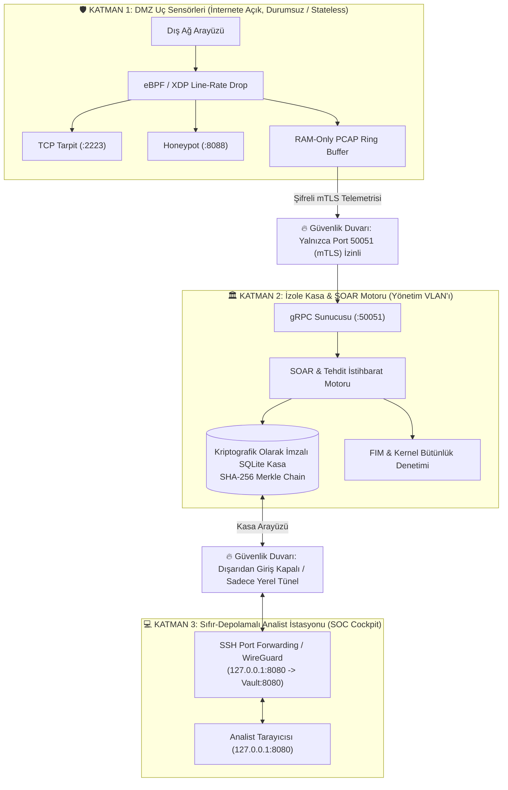
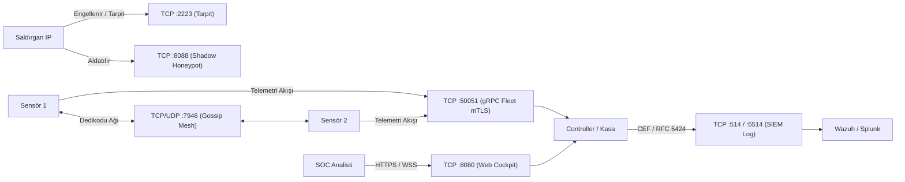

# CoPSeC Kurulum & Dağıtım Topolojileri Rehberi

> Bu doküman, CoPSeC Enterprise XDR & eBPF/XDP platformunun farklı altyapı ve operasyonel gereksinimlere göre kurulum modellerini, veri akış şemalarını, ağ port gereksinimlerini ve doğrulama adımlarını içermektedir.

---

## 🗺️ Dağıtım Modelleri Özeti

| Topoloji Modeli | Hedef Altyapı | Düğüm Sayısı | Temel Bileşenler | Güvenlik İzolasyonu |
| :--- | :--- | :--- | :--- | :--- |
| **Topoloji 1: Standalone All-In-One** | Tek Sunucu / VPS / Geliştirici | 1 Düğüm | Controller + Collector + Web SOC + SQLite | Yerel Loopback İzolasyonu |
| **Topoloji 2: Dağıtık Kurumsal Küme** | Orta/Büyük Ölçekli Ağlar | 2 - 50+ Düğüm | 1 Central Vault + Çoklu Edge Sensörler (Gossip Mesh) | Ağ Düzeyi Sensör Ayrımı |
| **Topoloji 3: 3-Katmanlı Sıfır Güven SOC** | Kritik Altyapılar & Bankacılık | 3+ Katman | DMZ Sensörleri + İzole Yönetim Kasası + Analist İstasyonları | Tam Katmanlar Arası İzolasyon |
| **Topoloji 4: Uç Nokta / Mikro Cihaz** | Alpine Linux / LXC / Router | 1+ Düğüm | Hafif eBPF Sensörü + OpenRC / Musl | Minimal Kaynak Tüketimi |

---

## 🏛️ Topoloji 1: Standalone All-in-One (Tek Sunucu / VPS)

Tüm bileşenlerin (eBPF/XDP motoru, Tarpit, Deception bal küpleri, SQLite WAL kasası ve Minimalist Web SOC Kokpiti) tek bir fiziksel sunucu veya sanal makine (VPS) üzerinde çalıştığı modeldir.

### Mimari ve Kurulum Şeması

```mermaid
flowchart TD
    subgraph Internet ["🌐 Dış Ağ / Saldırı Trafiği"]
        ATTACKER["Saldırgan / Tarayıcı"]
        CLIENT["Meşru Kullanıcı"]
    end

    subgraph Host ["💻 Tek Sunucu (Standalone Host - 192.168.1.10)"]
        NIC["Ağ Arayüzü (eth0)"]
        
        subgraph KernelSpace ["🐧 Linux Çekirdek Alanı (Kernel Space)"]
            XDP["eBPF / XDP Sürücü Kancası"]
            BPF_MAP["banned_ips (BPF Hash Map)"]
            XDP_DROP["XDP_DROP (<10µs Line-Rate)"]
            PASS["XDP_PASS (İzin Verilen Paketler)"]
        end

        subgraph UserSpace ["⚙️ Kullanıcı Alanı (User Space Daemons)"]
            subgraph CollectorSvc ["copsec-collector.service"]
                TARPIT["TCP Tarpit (:2223)"]
                HONEY["Shadow Honeypot (:8088)"]
                PCAP["RAM PCAP Ring Buffer"]
                TAILERS["Log Tailers (Nginx, Auth, Suricata)"]
            end

            subgraph ControllerSvc ["copsec-controller.service"]
                GRPC["gRPC Telemetri Hub (127.0.0.1:50051)"]
                SOAR["Otonom SOAR & Korelasyon"]
                DB[("SQLite Değişmez Kasa\n/var/lib/copsec/vault.db")]
                WEBSOC["Web SOC Kokpiti (:8080)"]
            end

            CLI["copsec CLI"]
        end
    end

    ATTACKER -->|SYN Flood / Exploit| NIC
    CLIENT -->|Normal Web İsteği| NIC
    NIC --> XDP
    XDP -->|Karantinadaki IP| BPF_MAP
    BPF_MAP -->|Engelle| XDP_DROP
    XDP -->|Temiz Trafik| PASS
    PASS --> TARPIT
    PASS --> HONEY
    PASS --> PCAP
    PASS --> TAILERS

    TAILERS -->|Yerel gRPC Akışı| GRPC
    GRPC --> SOAR
    SOAR -->|Tetikle / Ban| BPF_MAP
    SOAR -->|Yaz (Append-Only)| DB
    WEBSOC <-->|Veri Oku / WebSocket| DB
    CLI <-->|Yönetim| ControllerSvc
```

### Kurulum Adımları
```bash
# Tek komutla bağımsız kurulum (Tüm servisler otomatik yapılandırılır)
curl -fsSL https://raw.githubusercontent.com/CoPdasten/copsec/main/scripts/install.sh \
  | sudo bash -s -- --role=standalone --interface=eth0
```

* **Aktif Portlar:** `:8080` (Web SOC), `127.0.0.1:50051` (Dahili gRPC loopback)
* **Kasa Veritabanı:** `/var/lib/copsec/vault.db`
* **Doğrulama:** `copsec status` ve `copsec rules`

---

## 🌐 Topoloji 2: Dağıtık Kurumsal Küme (Distributed Enterprise Cluster)

Merkezi bir **Controller / Vault** düğümü ile korunacak çok sayıda hedef sunucuda çalışan **Collector (Edge Sensör)** düğümlerinden oluşur. Uç sensörler kendi aralarında **Memberlist Gossip Protokolü (`:7946`)** üzerinden haberleşerek engellenen IP'leri merkezi denetleyiciyi beklemeden mikrosaniyeler içinde kümedeki tüm düğümlerin eBPF XDP haritasına yansıtır.

### Mimari ve Kurulum Şeması

```mermaid
flowchart TD
    subgraph Traffic ["🌍 Gelen Ağ Trafiği"]
        ATTACK["Saldırı & Tarama Trafiği"]
    end

    subgraph EdgeNodes ["🛡️ Uç Nokta Sensörleri (Edge Sensors)"]
        subgraph Node1 ["Sensör 1 (pardus1 - 192.168.1.8)"]
            XDP1["eBPF/XDP Fast-Drop"]
            COLL1["Collector Servisi"]
            TARPIT1["TCP Tarpit (:2223)"]
        end

        subgraph Node2 ["Sensör 2 (pardus2 - 192.168.1.11)"]
            XDP2["eBPF/XDP Fast-Drop"]
            COLL2["Collector Servisi"]
            TARPIT2["TCP Tarpit (:2223)"]
        end

        subgraph NodeN ["Sensör N (Edge Server)"]
            XDPN["eBPF/XDP Fast-Drop"]
            COLLN["Collector Servisi"]
        end
    end

    subgraph Central ["🧠 Merkezi Yönetim ve Kasa (Controller Node - 192.168.1.10)"]
        GRPC_HUB["gRPC Fleet Ingestion Hub (:50051)"]
        SOAR_ENGINE["Otonom SOAR & Tehdit Korelasyonu"]
        SQLITE_VAULT[("Değişmez Kriptografik Kasa\nSHA-256 Hash Chain")]
        SIEM_EXPORT["SIEM Exporter (CEF / RFC 5424)"]
        WEB_COCKPIT["Web SOC Cockpit (:8080)"]
    end

    subgraph ExternalSIEM ["📊 Kurumsal SIEM & Log Deposu"]
        WAZUH["Wazuh SIEM"]
        SPLUNK["Splunk / Elastic"]
    end

    ATTACK --> Node1
    ATTACK --> Node2
    ATTACK --> NodeN

    COLL1 <-->|⚡ Gossip Mesh (:7946)\nLine-Rate Ban Senkronizasyonu| COLL2
    COLL2 <-->|⚡ Gossip Mesh (:7946)| COLLN

    COLL1 -->|mTLS gRPC Akışı (:50051)| GRPC_HUB
    COLL2 -->|mTLS gRPC Akışı (:50051)| GRPC_HUB
    COLLN -->|mTLS gRPC Akışı (:50051)| GRPC_HUB

    GRPC_HUB --> SOAR_ENGINE
    SOAR_ENGINE --> SQLITE_VAULT
    SOAR_ENGINE --> SIEM_EXPORT
    SIEM_EXPORT --> WAZUH
    SIEM_EXPORT --> SPLUNK

    WEB_COCKPIT <--> SQLITE_VAULT
```

### Kurulum Adımları

#### Adım 1: Merkezi Denetleyici (Controller / Vault) Kurulumu
```bash
# Merkezi sunucuda (örn. 192.168.1.10):
curl -fsSL https://raw.githubusercontent.com/CoPdasten/copsec/main/scripts/install.sh \
  | sudo bash -s -- --role=controller
```

#### Adım 2: Uç Nokta Sensörleri (Edge Sensors) Kurulumu
```bash
# 1. Uç Sensörde (örn. 192.168.1.8 - pardus1):
curl -fsSL https://raw.githubusercontent.com/CoPdasten/copsec/main/scripts/install.sh \
  | sudo bash -s -- --role=collector \
  --controller-ip=192.168.1.10 --interface=eth0

# 2. Uç Sensörde (örn. 192.168.1.11 - pardus2 - Gossip kümesine katılma):
curl -fsSL https://raw.githubusercontent.com/CoPdasten/copsec/main/scripts/install.sh \
  | sudo bash -s -- --role=collector \
  --controller-ip=192.168.1.10 --interface=eth0 \
  --gossip-join=192.168.1.8:7946
```

---

## 🔒 Topoloji 3: 3-Katmanlı Sıfır Güven SOC Mimarisi (Zero-Trust 3-Tier Enterprise SOC)

Kritik altyapılar ve yüksek güvenlikli kurumsal ortamlar için görevlerin fiziksel ve mantıksal olarak ayrıldığı modeldir. Veritabanı ve SOAR motoru dış ağdan tamamen izole edilmiş bir Yönetim VLAN'ında tutulur; analistler kokpite yalnızca şifreli SSH tüneli veya WireGuard üzerinden erişir.

### Mimari ve Kurulum Şeması



### Kurulum Adımları

#### 1. Katman 2: Özel Kasa Sunucusu (Vault Server)
```bash
curl -fsSL https://raw.githubusercontent.com/CoPdasten/copsec/main/scripts/install.sh \
  | sudo bash -s -- --role=vault-server
```

#### 2. Katman 1: DMZ Uç Sensörleri
```bash
curl -fsSL https://raw.githubusercontent.com/CoPdasten/copsec/main/scripts/install.sh \
  | sudo bash -s -- --role=collector \
  --controller-ip=<VAULT_IP> --interface=eth0
```

#### 3. Katman 3: Analist Kokpit İstasyonu
```bash
# Analist makinesinden Kasa Sunucusuna güvenli tünel açma:
ssh -N -L 8080:127.0.0.1:8080 copdasten@<VAULT_IP>
# Tarayıcıdan açın: http://127.0.0.1:8080
```

---

## ⚡ Ağ Portları ve Güvenlik Duvarı Akış Matrisi

Aşağıdaki şema ve tablo, CoPSeC bileşenleri arasındaki tüm ağ trafiğini ve güvenlik duvarında açılması gereken kuralları tanımlar:



### Port Referans Tablosu

| Port | Protokol | Yön | Kaynak | Hedef | Kullanım Amacı |
| :--- | :--- | :--- | :--- | :--- | :--- |
| **8080** | TCP | Gelen (Ingress) | Analist / Yönetim | Controller | Web SOC Kokpiti & REST API |
| **50051** | TCP | Gelen (Ingress) | Edge Sensörler | Controller | gRPC Çift Yönlü Telemetri & Komuta Akışı |
| **7946** | TCP/UDP | Çift Yönlü | Edge Sensör | Edge Sensör | Memberlist Gossip Tehdit Senkronizasyonu |
| **2223** | TCP | Gelen (Ingress) | Dış Ağ / Saldırganlar | Edge Sensör | Sıfır-Pencereli TCP Tarpit Tuzak Bağlantısı |
| **8088** | TCP | Gelen (Ingress) | Dış Ağ / Saldırganlar | Edge Sensör | Shadow Honeypot Aldatmaca Servisi |
| **514 / 6514**| TCP | Giden (Egress) | Controller | Kurumsal SIEM | ArcSight CEF / RFC 5424 Syslog Gönderimi |

---

## 🐳 Konteyner ve Docker Compose ile Hızlı Başlangıç

Geliştirme veya hızlı test ortamlarında tek komutla ayağa kaldırmak için `docker-compose.yml` desteği sunulmaktadır:

```yaml
version: '3.8'

services:
  controller:
    image: copsec-controller:latest
    build:
      context: .
      dockerfile: Dockerfile
    container_name: copsec-controller
    restart: always
    ports:
      - "8080:8080"
      - "50051:50051"
    volumes:
      - copsec_vault:/var/lib/copsec
      - copsec_rules:/etc/copsec/rules
    environment:
      - COPSEC_CONF_DIR=/etc/copsec
    healthcheck:
      test: ["CMD", "wget", "-qO-", "http://127.0.0.1:8080/health"]
      interval: 10s
      timeout: 3s
      retries: 3

volumes:
  copsec_vault:
  copsec_rules:
```

### Başlatma Komutu:
```bash
docker compose up -d
```

---

## 🔍 Kurulum Sonrası Doğrulama ve Sağlık Kontrolleri

Kurulum tamamlandıktan sonra aşağıdaki komutlarla küme sağlığı doğrulanabilir:

```bash
# 1. Küme genel durumunu, aktif banları ve EPS hızını inceleyin
copsec status

# 2. Bağlı uç nokta sensörlerini ve kaynak kullanımlarını kontrol edin
copsec fleet

# 3. Yüklenen 72 Sigma ve dinamik tespit kuralını doğrulayın
copsec rules

# 4. Aktif çekirdek karantina listesini inceleyin
copsec bans

# 5. Servis günlüklerini canlı takip edin
copsec logs controller -f
```
